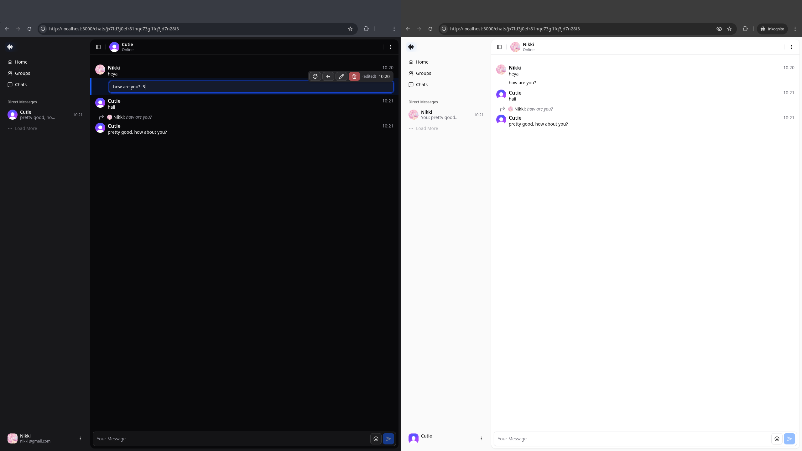

# 📡 Voxa — Realtime Chat App

> A sleek, serverless, full-stack real-time chat app with public channels, DMs, and media support — powered by **Next.js**, **Convex**, **Clerk**, and **UploadThing**.

---

## ✨ Features

- 🔐 Authentication via Clerk (OAuth, email, magic links, etc.)
- 💬 Real-time chat with reactive Convex queries
- 📁 Image uploads via UploadThing
- 🧵 Public channels, private DMs, and one-on-one threads
- ✍️ Typing indicators and presence tracking
- 🖼️ Inline image/media previews
- ⚡ Serverless & scalable — deploy to Vercel in minutes
- 💖 Designed for accessibility, responsiveness, and minimal latency

---

## 🧱 Tech Stack

| Layer       | Tech                                          |
| ----------- | --------------------------------------------- |
| Frontend    | Next.js (App Router), Tailwind CSS, Shadcn/UI |
| Backend     | Convex functions & database                   |
| Auth        | Clerk                                         |
| File Upload | UploadThing                                   |
| Realtime    | Convex Live Queries                           |
| Deployment  | Vercel (Frontend + Convex CLI)                |

---

## 📁 Image Upload with UploadThing

- 📎 Endpoint: `messageImage`
- 📐 Max size: 4MB
- 🖼️ Returns: `imageUrl` to be stored in messages
- ✅ Works perfectly with Convex + Next.js

---

## ✅ Roadmap

- [x] Real-time messaging with Convex
  - [x] Editing messages
  - [x] Deleting messages
  - [x] Reactions
  - [x] Replying to messages
    - [x] Scroll to messages if reference is clicked
- [x] User presence view (online/offline)
- [x] Unread messages indicator
- [x] Typing indicator
- [x] Uploading images

---

## 🚀 Deployment

- Frontend: [Vercel](https://vercel.com)
- Backend: [Convex](https://dashboard.convex.dev)
- Auth: [Clerk](https://clerk.dev)
- Image hosting: [UploadThing](https://uploadthing.com)

All serverless. No backend infra to maintain.

---

## 🧃 About

**Voxa** is a personal project built for learning, experimenting, and chatting with style. Real-time communication meets simplicity.

Made by [@CuteNikki](https://github.com/CuteNikki) — with love, focus, and a sprinkle of chaos.

---

## 📄 License

MIT — free to use, fork, and build upon 💬
